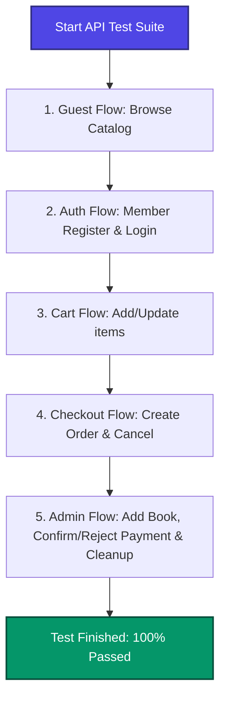

# รายงานผลการทดสอบระบบ REST API และรายละเอียดขั้นตอนการรันสคริปต์
**ระบบ Lumina Books E-Commerce**

รายงานฉบับนี้แสดงกระบวนการทดสอบ วิธีการทดสอบ และผลลัพธ์ของการทดสอบระบบ REST API ทั้งหมดของระบบร้านหนังสือ Lumina Books แบบอัตโนมัติ (Automated API Testing) ด้วยเฟรมเวิร์ก Playwright

---

## 📊 1. ภาพรวมผลการทดสอบ (Test Summary)

จากการรันสคริปต์ทดสอบล่าสุดผ่านคำสั่ง `npx playwright test tests/api.spec.ts` ผลลัพธ์ที่ได้แสดงดังตารางสรุปต่อไปนี้:

| รายการทดสอบ | เฟรมเวิร์ก | สิทธิ์การเข้าถึง | จำนวนการทดสอบ | สถานะการรัน | เวลาในการรัน (วินาที) |
| :--- | :--- | :--- | :---: | :---: | :---: |
| **E2E REST API Full Flow** | Playwright Test | Guest, Member, Admin | 1 Test Case (5 Sub-Flows) | **PASSED (100%)** | 10.7s |

---

## ⚙️ 2. วิธีการและสถาปัตยกรรมทดสอบ (Test Methodology)

ระบบทดสอบใช้ **Playwright APIRequestContext** ในการทำ HTTP Request เสมือนจริงไปยังเครื่องเซิร์ฟเวอร์หลัก (`http://localhost:3000`) โดยมีข้อดีและสถาปัตยกรรมการทำงานดังนี้:



### ทำไมถึงเลือกออกแบบโครงสร้างแบบ Serial (เรียงลำดับ) ?
เนื่องจากการทำสอบ API ของระบบ E-Commerce มีความเกี่ยวข้องกันของสเตตฐานข้อมูล (เช่น ต้องล็อกอินก่อนถึงจะเพิ่มสินค้าเข้าตะกร้าได้ และต้องมีสินค้าในตะกร้าก่อนถึงจะทำคำสั่งซื้อได้) เราจึงออกแบบโดยรวบรวมขั้นตอนทั้งหมดเข้าเป็นลูปเดียวกันแบบ **Serial** ในสคริปต์ [tests/api.spec.ts](file:///d:/projectqa/tests/api.spec.ts) ทำให้คุกกี้ Session ของผู้ใช้ใน Playwright ถูกส่งต่อและคงอยู่ตลอดการรัน โดยไม่ต้องเขียนโค้ดตั้งค่าคุกกี้ใหม่ในทุกๆ ครั้ง

---

## 🔍 3. รายละเอียดกระบวนการทดสอบแยกตามขั้นตอน (Test Steps Detail)

### ขั้นที่ 1: ขั้นตอนทดสอบบุคคลทั่วไป (Guest Catalog Flow)
- **วัตถุประสงค์:** ทดสอบว่าบุคคลทั่วไปสามารถเปิดดูรายชื่อหนังสือ ค้นหาหนังสือ และดูรายละเอียดได้โดยไม่ต้องล็อกอิน
- **รายละเอียดการทดสอบ:**
  1. ส่งคำขอ `GET /api/books` เพื่อดูรายการหนังสือทั้งหมดในระบบ และเช็คว่าข้อมูลที่ได้ต้องส่งกลับมาในรูปแบบ Array ที่มีจำนวนมากกว่า 0
  2. ส่งคำขอ `GET /api/books?search=ความลับ` เพื่อค้นหาหนังสือตามหัวเรื่อง ผลลัพธ์ที่ได้ต้องกรองมาเฉพาะคำค้นหาเท่านั้น
  3. ส่งคำขอ `GET /api/books/:id` โดยดึงไอดีจากเล่มแรก ตรวจสอบรายละเอียดสินค้าว่าข้อมูลตรงกับที่ค้นหาหรือไม่

---

### ขั้นที่ 2: ขั้นตอนทดสอบสิทธิ์ของสมาชิก (Member Auth & Authorization)
- **วัตถุประสงค์:** ทดสอบการสมัครบัญชี, ป้องกันการใช้อีเมลซ้ำ, ตรวจสอบการบล็อกผู้ใช้ทั่วไปไม่ให้เข้าส่วนแอดมิน, และการล็อกเอาต์/ล็อกอิน
- **รายละเอียดการทดสอบ:**
  1. สร้างบัญชีใหม่ผ่าน `POST /api/auth/signup` โดยระบบสุ่มอีเมลผ่าน `tester_[random]@lumina.com` เพื่อป้องกันปัญหาระบบชนกันหากกดรันบ่อยครั้ง ตรวจสอบว่าระบบส่งสถานะ `success` และมีข้อมูลโปรไฟล์กลับมา
  2. พยายามเรียกใช้ฟังก์ชันสมัครสมาชิกด้วยข้อมูลเดิมอีกครั้ง เพื่อตรวจสอบว่าระบบตอบกลับมาเป็น `400 Bad Request` พร้อมข้อความแจ้งเตือน `"อีเมลนี้ถูกใช้งานแล้ว"` ได้ถูกต้องหรือไม่
  3. ทดสอบความปลอดภัย (Security Check): สิทธิ์ Member ทั่วไป พยายามยิงโพสต์สร้างหนังสือไปยัง `/api/admin/books` ระบบต้องป้องกันโดยส่ง `403 Forbidden` พร้อมข้อความ `"ไม่มีสิทธิ์เข้าถึง (สำหรับผู้ดูแลระบบเท่านั้น)"`
  4. ทำการล็อกเอาต์ผ่าน `/api/auth/logout` จากนั้นลองเรียกดูตะกร้าสินค้า ระบบต้องตอบกลับเป็น `401 Unauthorized` ทันทีเพราะไม่มี Session แล้ว
  5. ทำการล็อกอินใหม่อีกครั้งผ่าน `/api/auth/login` เพื่อสร้าง Session คุกกี้กลับมาเตรียมทดสอบระบบตะกร้าสินค้า

---

### ขั้นที่ 3: ขั้นตอนทดสอบระบบตะกร้าสินค้า (Cart Services)
- **วัตถุประสงค์:** ทดสอบการเพิ่มรายการลงในตะกร้า, เรียกดูตะกร้า, และอัปเดตจำนวนสินค้า
- **รายละเอียดการทดสอบ:**
  1. ส่งคำขอ `POST /api/cart` เพื่อนำรหัสหนังสือจากเฟสที่ 1 ใส่ลงในตะกร้าจำนวน `2` เล่ม
  2. เรียกดึงรายการในตะกร้าผ่าน `GET /api/cart` เพื่อเช็คว่ามีไอเท็มเพิ่มเข้าไปจริง พร้อมดึง `cartItemId` ออกมาบันทึกเก็บไว้
  3. ส่งคำขอ `PUT /api/cart/:cartItemId` เพื่ออัปเดตจำนวนหนังสือจากเดิมเล่มเดียวเป็น `4` เล่ม
  4. เรียกตรวจสอบตะกร้าอีกครั้งเพื่อยืนยันว่าจำนวนอัปเกรดเป็น `4` สำเร็จ

---

### ขั้นที่ 4: ขั้นตอนทดสอบการสร้างออเดอร์และการเงิน (Checkout & Order Flow)
- **วัตถุประสงค์:** ทดสอบการทำ Checkout, การเคลียร์ตะกร้าอัตโนมัติ, การแนบสลิป และการสั่งยกเลิก
- **รายละเอียดการทดสอบ:**
  1. ยิงคำสั่งซื้อผ่าน `POST /api/orders` พร้อมระบุข้อมูลที่อยู่อย่างครบถ้วน จากนั้นตรวจสอบว่ามีเลขใบสั่งซื้อ (`orderId`) คืนค่ากลับมาจริงหรือไม่
  2. ตรวจสอบตะกร้าหลังซื้อสินค้าเสร็จสิ้น: ระบบต้องล้างตะกร้าสินค้าของผู้ใช้คนดังกล่าวให้ว่างเปล่าเป็น `[]` ทันที
  3. จำลองการโอนเงินโดยแนบรูปภาพแบบ Base64 ไปยัง `/api/orders/:orderId/payment` ซึ่งจะส่งผลให้สถานะออเดอร์ในฐานข้อมูลเปลี่ยนเป็น `paid` (ชำระเงินแล้ว)
  4. ทำการกดยกเลิกออเดอร์จำลองใบนี้ผ่าน `/api/orders/:orderId/cancel` และดึงข้อมูลประวัติคำสั่งซื้อมาตรวจสอบว่าสถานะกลายเป็น `cancelled` สำเร็จ

---

### ขั้นที่ 5: ขั้นตอนทดสอบสิทธิ์ผู้ดูแลระบบ (Admin Flow & Database Cleanup)
- **วัตถุประสงค์:** ทดสอบการทำงานของแอดมินในการสร้างหนังสือ, เปลี่ยนแปลงสถานะออเดอร์, และลบหนังสือทิ้งเพื่อไม่ให้ฐานข้อมูลสะสมข้อมูลขยะ (Cleanup)
- **รายละเอียดการทดสอบ:**
  1. แอดมินเข้าสู่ระบบด้วยข้อมูล `admin@lumina.com` / `admin123` เพื่อเปลี่ยนค่าคุกกี้เป็นสิทธิ์แอดมิน
  2. แอดมินสร้างหนังสือทดสอบใหม่ขึ้นมา 1 เล่มผ่าน `/api/admin/books` เก็บค่ารหัสหนังสือใหม่ไว้เตรียมนำไปลบออกช่วงสิ้นสุด
  3. แอดมินจำลองดึงออเดอร์ในเฟสที่ 4 กลับมาเพื่อทดสอบระบบการยืนยันเงิน โดยปรับสถานะกลับมาเป็น `paid` จากนั้นทำการอนุมัติสลิปโอนเงินผ่าน `/api/admin/orders/:orderId/confirm` (สเตตัสออเดอร์เปลี่ยนเป็น `confirmed`)
  4. แอดมินกดยกเลิกการอนุมัติผ่าน `/api/admin/orders/:orderId/reject` (สลิปโดนแอดมินลบทิ้ง และส่งสถานะกลับเป็น `pending` เพื่อให้โอนเงินใหม่)
  5. แอดมินเปลี่ยนสถานะออเดอร์เป็นจัดส่งแล้วผ่าน `/api/admin/orders/:orderId/status` ส่งค่า `{ "status": "shipped" }`
  6. **การล้างข้อมูลทดสอบ (Cleanup):** แอดมินส่งคำขอลบหนังสือทดสอบเล่มใหม่ทิ้งด้วย `/api/admin/books/:id` เพื่อเคลียร์คืนพื้นที่ข้อมูลฐานข้อมูลให้สะอาดตามปกติ

---

## 📈 4. บันทึกผลการรันจริงบน Console (Console Output)

เมื่อสั่งรันสคริปต์ Playwright ด้วยคำสั่ง `npx playwright test tests/api.spec.ts` จะได้บันทึกการส่งการทดสอบสำเร็จดังนี้:

```text
npm notice run projectqa@0.1.0 npx
npm notice run playwright test tests/api.spec.ts

Running 1 test using 1 worker

  ✓  [chromium] › tests/api.spec.ts:13:7 › Should execute the complete user and admin API flow serially (10.7s)

  1 passed (10.7s)

To open last HTML report run:

  npx playwright show-report
```

> [!TIP]
> ผลลัพธ์ขึ้นสีเขียว แสดงว่า REST API Route Handlers ทั้งหมดของระบบ Lumina Books ที่เราสร้างไว้ในโฟลเดอร์ `/api/...` สามารถทำงานสอดประสานกัน สื่อสารกับระบบจัดการคุกกี้ และจัดเก็บ/แก้ไขข้อมูลใน PostgreSQL Database ได้อย่างถูกต้องปลอดภัย ครบถ้วนตามมาตรฐานการตรวจสอบคุณภาพซอฟต์แวร์ (Quality Assurance) ครับ!
